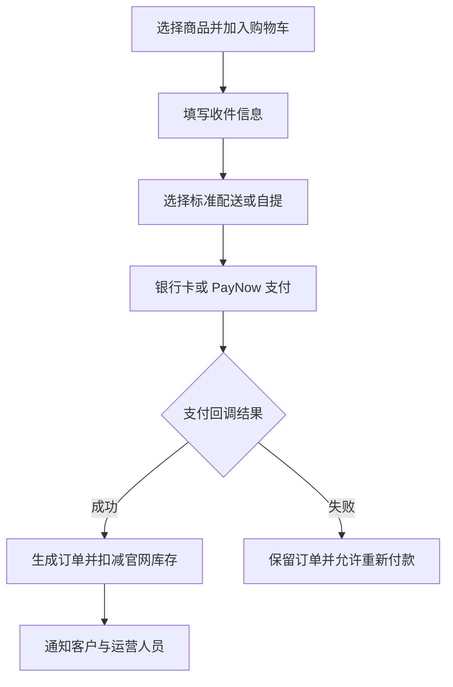

# Trinity Globe 自营商城产品需求文档（PRD）

> 文档版本：v1.0  
> 日期：2026-08-18  
> 项目：Trinity Globe 自营商城  
> 参照站点：Paneco Singapore  
> 当前重点：在现有官网基础上完成“购物车 + 配送 + 在线支付 + 订单处理”的自主交易闭环

---

## 0. 文档摘要

Trinity Globe 当前官网已经具备商品展示、搜索、分类筛选、价格展示以及 WhatsApp、微信、电话等咨询入口，但尚未形成完整的在线交易闭环。客户仍需通过 WhatsApp、微信或 Shopee 完成人工核价、下单及付款。

本项目计划在现有官网基础上增加轻量商城能力，使客户可以：

1. 将商品加入购物车；
2. 选择标准配送或自提；
3. 填写配送地址；
4. 使用银行卡或 PayNow 在线付款；
5. 自动收到订单确认；
6. 由 Trinity Globe 后台统一处理订单、库存、配送及退款。

项目第一期只解决“客户能在官网直接完成付款，公司能够稳定接单和履约”这一核心问题。会员积分、会员等级、复杂促销、推荐返现以及 Shopee 实时库存同步均后置。

---

## 1. 项目背景

### 1.1 当前销售模式

目前 Trinity Globe 的线上交易主要通过以下方式完成：

- Shopee 店铺下单；
- WhatsApp 人工沟通；
- 微信人工沟通；
- 线下转账或人工确认付款；
- 人工安排配送或自提。

当前官网承担品牌展示和商品介绍作用，但缺少购物车、结账页、在线支付、订单后台和自动库存处理。

### 1.2 当前主要问题

1. **Shopee 渠道费用较高**

   Trinity Globe 实际订单已经出现 9.81% Commission Fee，且 Shopee 还可能根据订单情况收取 Transaction Fee、项目服务费或其他适用费用。

2. **价格和促销规则受到平台限制**

   Shopee 的佣金、活动和店铺规则由平台制定，公司无法完全掌控。

3. **客户数据无法完整沉淀**

   交易主要发生在 Shopee 时，公司难以完整掌握客户的购买记录、复购情况与营销数据。

4. **人工下单效率有限**

   WhatsApp 和微信适合咨询与大额订单沟通，但不适合承担全部标准订单的核价、收款和订单记录工作。

5. **独立站无法直接产生交易**

   客户在官网看到商品后仍需跳转或联系人工，购买链路较长，容易流失。

### 1.3 为什么参考 Paneco

Paneco 是新加坡本地成熟的酒类自营电商，可作为商城功能和交易体验参照。根据 Paneco 官方公开信息：

- 银行卡支付网关使用 Stripe；
- 另行支持 PayPal；
- 支持商品分类、搜索、购物车和在线结账；
- 支持次日配送、当日配送、加急配送和自提；
- 具备会员积分及分级会员体系；
- 具备客服、FAQ、配送和退换货说明。

本项目不要求第一期复制 Paneco 的全部功能，而是参考其完整交易链路，优先补齐 Trinity Globe 的核心缺口。

---

## 2. 费用概念说明

### 2.1 Shopee 9.81% 的性质

Trinity Globe 订单中出现的 9.81% 是 Shopee 向商家收取的 Commission Fee，不是新加坡政府对独立站统一征收的电商费率。

如果该 9.81% 为 GST-inclusive commission rate，其数学组成对应：

| 项目 | 费率 |
|---|---:|
| Shopee 基础佣金 | 9.00% |
| Shopee 佣金对应的 9% GST | 0.81% |
| Shopee 扣除合计 | 9.81% |

客户在 Trinity Globe 官网直接购买时，不需要向 Shopee 支付这项 Commission Fee，但仍会产生支付网关手续费、网站运营成本、配送成本及可能的银行卡争议成本。

### 2.2 独立站支付手续费

根据 Stripe Singapore 在 2026-08-18 的公开标准费率：

| 支付方式 | 公开标准费率 |
|---|---:|
| 新加坡本地银行卡 | 3.4% + S$0.50 / 笔 |
| PayNow | 1.3% / 笔 |
| Apple Pay / Google Pay | 按绑定银行卡费率计算 |

最终费率、可用支付方式、结算周期和商户审核结果以 Trinity Globe 与支付机构签约时的最新确认结果为准。

### 2.3 公司 GST 与平台费的区别

Trinity Globe 的应税营业额目前已达到 S$1 million 强制 GST 注册门槛。公司需要由财务立即确认：

- GST 注册责任触发日期；
- 属于 retrospective view 还是 prospective view；
- GST 申请截止日期；
- GST 注册生效日期；
- 官网与 Shopee 的价格调整方案；
- 税务发票与 GST 申报流程。

Shopee Commission Fee、支付网关手续费和公司对商品销售收取的 Output GST 是不同项目，后台和财务报表必须分别记录。

---

## 3. 项目目标与非目标

### 3.1 第一阶段目标

第一阶段 MVP 的目标是：

> 客户能够在 Trinity Globe 官网将商品加入购物车，填写收货信息，选择标准配送或自提，通过银行卡或 PayNow 完成付款；系统自动生成订单、扣减官网库存并通知客户与工作人员。

具体目标：

- 建立自主在线收款能力；
- 降低标准订单对 Shopee 和人工收款的依赖；
- 保留 WhatsApp、微信和电话作为咨询及大额订单入口；
- 支持标准配送、自提和满额包邮；
- 建立基础订单后台；
- 建立官网独立库存池；
- 满足酒类线上销售、年龄提示、价格和隐私相关基础要求；
- 为后续会员、促销和多渠道库存同步预留扩展能力。

### 3.2 第一阶段非目标

以下功能不纳入第一期：

- 会员积分；
- Bronze、Silver、Gold、Platinum 等会员等级；
- 推荐返现；
- 复杂满减和组合促销；
- 两小时加急配送；
- 配送时间段预约；
- Shopee 实时 API 库存同步；
- 完整 CRM；
- 多仓库管理；
- 原生 iOS 或 Android App。

---

## 4. 用户与使用场景

### 4.1 用户角色

| 角色 | 主要需求 |
|---|---|
| 普通客户 | 搜索商品、加入购物车、选择配送、在线付款、接收订单通知 |
| 企业或大额客户 | 咨询整箱价格、批量采购、指定配送时间、索取正式报价 |
| 客服/运营 | 查看订单、联系客户、更新订单状态、处理取消与退款 |
| 仓库/配送人员 | 查看待备货商品、收件信息、配送方式和订单备注 |
| 管理员/老板 | 查看订单、销售额、付款状态和异常订单 |
| 财务 | 核对支付入账、手续费、GST、退款和发票记录 |

### 4.2 核心用户故事

1. 作为普通客户，我希望无需注册账号即可完成购买。
2. 作为客户，我希望在付款前看到商品金额、配送费和最终应付金额。
3. 作为客户，我希望选择标准配送或自提。
4. 作为客户，我希望使用银行卡或 PayNow 付款。
5. 作为客户，我希望付款后立即收到明确的订单确认。
6. 作为运营人员，我希望在后台看到每一笔订单的商品、收件人、付款和配送信息。
7. 作为仓库人员，我希望系统不会出售超过官网可用库存的数量。
8. 作为财务人员，我希望订单能区分商品金额、配送费、GST、支付手续费和退款。

---

## 5. Paneco 与 Trinity Globe 功能对比

| 功能模块 | Paneco 参照能力 | Trinity Globe 当前情况 | 本项目处理方式 |
|---|---|---|---|
| 商品展示 | 分类、搜索、促销专区、商品卡 | 已有搜索、分类筛选及商品卡 | 保留并适配购物车 |
| 价格体系 | 单瓶价、批量价、会员价、促销价 | 已有单瓶价、整箱价、5箱价 | 第一阶段沿用现有价格体系 |
| 购物车 | 多商品加购、修改数量、实时小计 | 无 | P0 新增 |
| 在线结账 | 地址、配送、付款、订单提交 | 无 | P0 新增 |
| 在线支付 | 银行卡经 Stripe；PayPal 独立支持 | 无标准在线支付 | P0 接入 Stripe 银行卡和 PayNow |
| 配送 | 次日、当日、加急、自提 | 满 S$120 包邮，人工安排 | P0 先做标准配送和自提 |
| 会员账户 | 登录、历史订单、地址等 | 无 | P1 |
| 积分与等级 | 多等级会员和积分抵扣 | 无 | P2 |
| 库存 | 在线可售状态 | 无统一在线扣减 | P0 建立官网独立库存池 |
| 订单通知 | 自动确认及订单状态 | 人工回复 | P0 自动通知 |
| 优惠码 | 支持促销与会员优惠 | 无 | P1 |
| 客服入口 | WhatsApp、微信、电话等 | 已有 WhatsApp、微信、电话 | 保留，后续补 FAQ |
| 年龄合规 | 线上年龄及酒类购买提示 | 尚不完整 | P0 补齐 |

---

## 6. 功能优先级

### 6.1 P0 - 第一阶段必须上线

- 购物车；
- Guest Checkout；
- 收件人和配送地址；
- Standard Delivery；
- Self Collection；
- 满 S$120 免运费；
- 未满包邮门槛的运费计算；
- Stripe 银行卡支付；
- Stripe PayNow；
- 支付成功、失败和重复提交处理；
- 官网独立库存池；
- 付款前库存校验；
- 支付成功后自动扣减库存；
- 自动创建订单；
- 客户、客服和老板通知；
- 基础订单后台；
- 取消与退款处理；
- GST 价格和订单税务字段；
- 18 岁年龄确认、违法警告和处罚提示；
- Terms、Privacy、Delivery、Refund Policy。

### 6.2 P1 - 第一阶段稳定后补充

- 登录注册；
- 地址簿；
- 历史订单；
- 优惠码；
- 简单满减；
- 缺货和低库存提醒；
- FAQ；
- 配送状态查询；
- Shopee API 库存同步评估。

### 6.3 P2 - 后期增长功能

- 会员积分；
- 会员等级；
- 推荐返现；
- 会员价格；
- 复杂促销活动；
- 两小时或定时配送；
- 销售数据看板；
- 企业采购账户；
- CRM 和自动化营销。

---

## 7. P0 详细功能需求

### 7.1 商品与 SKU

每个可售商品必须具备：

- 商品名称；
- 商品主图；
- 品牌；
- 分类；
- 容量；
- 包装或礼盒说明；
- 单瓶价；
- 整箱价或批量价（如适用）；
- 官网可售库存；
- 是否上架；
- 内部统一 SKU；
- 是否允许自提；
- 是否参与满额包邮。

第一阶段沿用现有商品信息和价格结构，不强制增加会员价或限时促销价。

### 7.2 购物车

客户可以：

- 将商品加入购物车；
- 修改商品数量；
- 删除商品；
- 查看单价、小计和购物车总额；
- 查看是否达到满 S$120 免运费门槛；
- 从购物车进入结账页。

业务规则：

- 添加数量不得超过官网可售库存；
- 进入结账页时再次校验价格与库存；
- 商品价格发生变化时，结账页以服务器最新价格为准并提示客户；
- 购物车不能作为永久库存预留；
- 只有支付成功后才正式扣减库存。

### 7.3 Guest Checkout

第一阶段不强制注册账号。客户需填写：

- 姓名；
- 手机号；
- 邮箱；
- 配送地址；
- 邮编；
- 订单备注；
- 年龄确认。

如果选择自提，则配送地址可以不填，但手机号和邮箱仍为必填。

### 7.4 配送方式

#### Standard Delivery

- 支持新加坡境内符合服务范围的地址；
- 订单商品金额达到 S$120 时免标准运费；
- 未达到 S$120 时按照后台配置收取固定标准运费；
- 结账页必须在付款前展示运费和最终应付金额；
- 后台可配置预计配送时间说明；
- 支持通过邮编限制不可配送区域。

#### Self Collection

- 客户选择自提后不收取配送费；
- 结账页显示自提地址、营业时间和注意事项；
- 付款完成不代表可以立即取货；
- 客户需等待“可取货”通知后前往；
- 取货时工作人员核对订单号及年龄/身份信息。

#### 后续配送功能

以下功能后置：

- Same-Day Delivery；
- 两小时加急配送；
- 指定时间段；
- 多家配送商自动报价；
- 实时物流地图。

### 7.5 在线支付

第一阶段建议通过同一个 Stripe 商户账户支持：

- Visa；
- Mastercard；
- American Express（以账户实际开通结果为准）；
- PayNow。

支付要求：

- Trinity Globe 不保存完整银行卡号和 CVC；
- 使用 Stripe 托管页面或安全支付组件；
- 后端根据购物车最新价格创建支付订单；
- 不信任前端传入的商品总价；
- 通过支付回调/Webhook确认最终付款结果；
- 不仅依赖客户跳转到“支付成功”页面；
- 同一订单不得重复扣款；
- 支持支付失败后重新付款；
- 保存支付平台订单号、手续费、退款和结算状态；
- 支持全额退款；
- 部分退款作为建议能力，可根据第一期技术复杂度决定是否同时上线。

### 7.6 订单生成与状态

建议订单状态：

| 状态 | 含义 |
|---|---|
| Pending Payment | 已创建订单但尚未成功付款 |
| Paid | 支付成功，等待处理 |
| Preparing | 正在备货 |
| Ready for Collection | 自提订单可领取 |
| Out for Delivery | 配送中 |
| Completed | 已完成配送或自提 |
| Cancelled | 已取消 |
| Refunded | 已退款 |
| Payment Failed | 支付失败 |

关键规则：

- 支付成功后订单进入 Paid；
- 付款失败不得扣减正式库存；
- Webhook 重复到达不得重复创建订单或扣减库存；
- 取消订单是否恢复库存需由运营确认商品是否仍可销售；
- 已出库订单退款时不得自动恢复库存；
- 所有人工状态修改保留操作记录。

### 7.7 通知

支付成功后：

- 客户收到订单确认邮件；
- 客服/运营收到新订单通知；
- 老板可选择接收摘要通知；
- 通知中不得显示完整银行卡信息；
- 通知应包括订单号、商品、金额、配送方式和客户联系方式。

第一阶段至少使用邮件；WhatsApp 自动通知可在确认服务商和模板成本后补充。

### 7.8 基础订单后台

后台必须支持：

- 订单列表；
- 按订单号、姓名、手机号搜索；
- 按订单状态筛选；
- 查看商品、数量、价格和配送信息；
- 查看付款状态和支付平台订单号；
- 修改履约状态；
- 发起退款；
- 填写内部备注；
- 导出订单；
- 查看操作记录。

后台权限至少分为：

- 管理员；
- 运营/客服；
- 只读财务。

---

## 8. 库存方案

### 8.1 第一阶段：渠道库存池

第一阶段不开发 Shopee 实时库存同步，而是将实体库存分配为三个库存池：

| 库存池 | 用途 |
|---|---|
| 官网可售库存 | 只供 Trinity Globe 官网订单使用 |
| Shopee 可售库存 | 只供 Shopee 订单使用 |
| 安全库存 | 防止破损、盘点误差和并发超卖 |

示例：某商品仓库实际有 20 瓶：

| 分配 | 数量 |
|---|---:|
| 官网 | 10 |
| Shopee | 8 |
| 安全库存 | 2 |

规则：

- 官网订单只扣减官网库存；
- Shopee 订单只扣减 Shopee 库存；
- 运营每天或每两天根据销售情况重新分配库存；
- 稀有、单瓶或高价商品优先只在一个渠道上架；
- 官网库存为 0 时显示缺货并禁止付款；
- 退款或取消后必须由运营确认是否重新入库；
- 定期执行实体盘点。

### 8.2 第二阶段：Shopee API 自动同步

订单量提高后，可接入 Shopee Open Platform：

1. 为官网商品和 Shopee 商品建立统一 SKU 映射；
2. 官网支付成功后扣减主库存，并更新 Shopee 可售库存；
3. Shopee 新订单通过推送通知商城后台；
4. 后台扣减主库存并更新官网库存；
5. 取消或退款时按照退货状态决定是否恢复库存；
6. 保留安全库存；
7. 对同步失败进行重试和人工告警。

Shopee API 同步不纳入 P0，以免影响独立站首期上线。

---

## 9. 核心交易流程

### 9.1 正常支付流程

1. 客户选择商品；
2. 系统校验最新价格和官网库存；
3. 客户选择配送方式；
4. 系统计算商品金额、配送费和最终总额；
5. 客户确认年龄及政策；
6. 后端创建支付请求；
7. 客户完成银行卡或 PayNow 付款；
8. Stripe 向后端发送支付结果；
9. 系统确认订单只处理一次；
10. 系统扣减官网库存；
11. 订单进入 Paid；
12. 客户和工作人员收到通知。

### 9.2 库存不足流程

- 在结账时发现库存不足，禁止创建付款；
- 提示客户调整数量或移除缺货商品；
- 如果支付过程中出现并发订单，以最先确认成功的支付为准；
- 如发生已付款但无法履约的极端情况，运营必须立即联系客户并退款。

### 9.3 支付失败流程

- 订单进入 Payment Failed 或保持 Pending Payment；
- 不扣减正式库存；
- 客户可以重新付款；
- 系统不得因为刷新页面重复扣款。

---

## 10. GST、价格与财务要求

### 10.1 GST 上线前置事项

由于公司应税营业额已达到 S$1 million 门槛，商城上线前必须由财务确认：

- 是否已经提交 GST 注册；
- GST 生效日期；
- GST Registration Number；
- 官网售价是否调整；
- Shopee 和官网价格是否一致；
- 发票格式；
- 退款时 GST 如何冲回；
- 支付网关手续费的 Input GST 处理方式。

### 10.2 价格展示

如 Trinity Globe 已经正式成为 GST-registered business：

- 面向公众展示的价格应为 GST-inclusive；
- 结账前显示客户最终应付总额；
- 不在最后一步突然增加 GST；
- 后台分别记录未税金额、GST 金额和含税金额；
- 订单或发票显示适用的 GST 信息。

### 10.3 后台财务字段

每笔订单至少记录：

- 商品含税金额；
- 商品未税金额；
- Output GST；
- 配送费；
- 配送费 GST（如适用）；
- 支付手续费；
- 支付手续费 GST（以支付机构税务凭证为准）；
- 退款金额；
- 净入账金额；
- 支付机构结算批次或参考号。

---

## 11. 酒类销售与合规要求

### 11.1 酒牌

上线前必须确认现有 Liquor Licence 是否覆盖：

- Trinity Globe 当前经营主体；
- 商品供应和存放场所；
- 线上接受订单和付款；
- 配送或自提模式；
- 实际营业与供应时间。

如现有牌照不覆盖，应在上线收款前完成申请或调整。

### 11.2 年龄要求

结账页不得只显示普通的“我已满 18 岁”勾选。应至少：

- 明确要求购买者确认已满 18 岁；
- 警告未满 18 岁购买酒类属于违法行为；
- 告知相关处罚；
- 禁止未勾选客户继续付款；
- 在配送或自提环节保留年龄/身份核验机制；
- 避免向未成年人进行定向推广。

具体最终文案由公司根据新加坡法律要求审核。

### 11.3 政策页面

上线前必须具备：

- Terms & Conditions；
- Privacy Policy；
- Delivery Policy；
- Refund & Return Policy；
- Responsible Drinking / Age Restriction Notice；
- Contact Us。

---

## 12. 非功能需求

### 12.1 安全

- 网站全程使用 HTTPS；
- 不在 Trinity Globe 数据库保存完整银行卡号或 CVC；
- Stripe 密钥仅保存在后端安全环境；
- 支付回调需要验证签名；
- 后台需要登录和权限控制；
- 重要操作保留审计记录；
- 客户个人信息遵循最小必要原则保存；
- 定期备份订单数据。

### 12.2 性能

- 移动端优先；
- 购物车和结账页在正常网络环境下快速加载；
- 支付按钮点击后显示处理中状态；
- 防止客户重复点击；
- 图片进行压缩和延迟加载。

### 12.3 稳定性

- 支付成功后即使客户关闭网页，订单仍能通过 Webhook 正常生成；
- Webhook 支持重复调用但只能处理一次；
- 邮件通知失败不得影响订单生成；
- 支付、库存和订单异常需要留下日志；
- 关键错误通知管理员。

### 12.4 隐私与数据

- 清晰告知收集姓名、手机号、邮箱和地址的用途；
- 不收集完成交易不需要的信息；
- 限制员工访问客户数据；
- 支持按照公司政策处理客户的数据访问或删除请求。

---

## 13. 验收标准

### 13.1 核心购买验收

- 客户可以从商品页加入购物车；
- 客户可以修改数量和删除商品；
- 系统正确计算商品小计；
- 满 S$120 自动免标准运费；
- 未满 S$120 自动增加配置的标准运费；
- 客户可以选择标准配送或自提；
- 客户可以使用测试银行卡成功支付；
- 客户可以使用 PayNow 测试流程成功支付；
- 支付成功后只生成一个订单；
- 官网库存只扣减一次；
- 客户和运营收到订单通知；
- 后台可以查看和更新订单状态。

### 13.2 异常验收

- 库存不足时不能付款；
- 支付失败不扣库存；
- 重复支付回调不重复扣库存；
- 刷新支付成功页面不重复创建订单；
- 退款后后台正确记录退款状态；
- 配送地址缺失时不能提交配送订单；
- 自提订单不收取配送费；
- 未完成年龄确认不能继续付款。

### 13.3 财务验收

- 订单可以区分商品金额、配送费、GST 和支付手续费；
- 支付平台金额与后台订单金额一致；
- 可以导出订单和付款记录；
- 退款在后台和支付平台记录一致；
- GST 生效后订单使用正确税率和价格展示。

---

## 14. 项目阶段

### 第一阶段：MVP 自主收款

目标：客户能够在官网完成购物、配送选择和付款，公司能够接单、扣减官网库存并履约。

包含：

- 购物车；
- Guest Checkout；
- 标准配送和自提；
- 满 S$120 免运费；
- Stripe 银行卡和 PayNow；
- 官网渠道库存池；
- 基础订单后台；
- 客户和工作人员通知；
- GST、年龄和政策要求。

### 第二阶段：完善购买体验

包含：

- 登录注册；
- 地址簿；
- 历史订单；
- 优惠码；
- FAQ；
- 配送状态；
- Shopee API 库存同步评估或开发。

### 第三阶段：会员运营与增长

包含：

- 积分；
- 会员等级；
- 会员价格；
- 推荐返现；
- 复杂促销；
- 企业客户功能；
- 数据看板和 CRM。

---

## 15. 风险与应对

| 风险 | 影响 | 应对方式 |
|---|---|---|
| Stripe 商户审核未通过或延迟 | 无法按期收款 | 项目启动时优先申请并如实申报酒类业务 |
| GST 生效日期不明确 | 定价和发票错误 | 财务在开发定价逻辑前确认 |
| 官网与 Shopee 同时售卖导致超卖 | 无法履约 | 第一阶段采用渠道库存池和安全库存 |
| 客户付款成功但订单未生成 | 财务和履约异常 | 使用 Webhook、幂等处理和异常告警 |
| 配送成本高于预期 | 毛利下降 | 后台配置运费和免运门槛，先做标准配送 |
| 自有网站缺少自然流量 | 订单增长不足 | Shopee 继续作为获客渠道，独立站沉淀品牌和复购 |
| 在 Shopee 内违规引导站外交易 | 店铺处罚 | 不在 Shopee 站内违反平台规则引流 |
| 年龄核验不足 | 合规风险 | 结账警告、年龄确认、配送/自提核验 |
| 客户个人信息泄露 | 法律和品牌风险 | 最小化收集、权限管理、HTTPS和日志审计 |

---

## 16. 上线前必须确认的事项

### 16.1 老板/业务确认

- [ ] 未满 S$120 的标准运费金额；
- [ ] 标准配送预计时间；
- [ ] 自提地址和营业时间；
- [ ] 哪些商品可以自提；
- [ ] 官网是否与 Shopee 使用相同价格；
- [ ] Shopee 上线后是否继续经营；
- [ ] 官网与 Shopee 的初始库存分配比例；
- [ ] 退款与退货规则；
- [ ] 哪些员工接收订单通知。

### 16.2 财务/合规确认

- [ ] GST 注册责任触发日期；
- [ ] GST 申请和生效日期；
- [ ] GST-inclusive 定价方案；
- [ ] GST Registration Number；
- [ ] 税务发票格式；
- [ ] Liquor Licence 是否覆盖线上供应；
- [ ] 年龄警告与处罚文案；
- [ ] 配送和自提年龄核验方式。

### 16.3 技术确认

- [ ] 当前网站技术架构；
- [ ] 后端和数据库部署位置；
- [ ] Stripe 商户账户及审核状态；
- [ ] Stripe 银行卡可用性；
- [ ] Stripe PayNow 可用性；
- [ ] 邮件通知服务；
- [ ] 管理后台账号和权限；
- [ ] 备份、日志和监控方案。

---

## 17. 成功指标

第一阶段上线后建议跟踪：

- 官网购物车添加次数；
- 进入结账页人数；
- 支付成功率；
- 购物车到付款转化率；
- 官网订单量；
- 官网平均客单价；
- 银行卡与 PayNow 使用比例；
- 每笔订单平均支付手续费；
- 相较 Shopee 节省的平台费用；
- 库存异常和超卖次数；
- 退款率；
- 配送准时率；
- 客户重复购买率。

第一阶段最重要的上线目标：

> 完成真实订单从加购、配送、付款、生成订单、扣减库存、通知到完成履约的端到端测试，并确保没有重复扣款、重复订单或超卖。

---

## 18. 参考资料

- [Paneco Privacy Policy - 官方披露银行卡支付网关使用 Stripe](https://www.paneco.com.sg/privacy-policy)
- [Paneco FAQ - Visa、Mastercard、American Express 与 PayPal](https://www.paneco.com.sg/faq)
- [Paneco Delivery - 配送方式参考](https://www.paneco.com.sg/delivery)
- [Paneco Loyalty Program - 会员积分与等级参考](https://www.paneco.com.sg/loyalty)
- [Stripe Singapore Pricing](https://stripe.com/en-sg/pricing)
- [Stripe PayNow Documentation](https://docs.stripe.com/payments/paynow)
- [Shopee Singapore Commission Fee](https://seller.shopee.sg/edu/article/2450)
- [Shopee Open Platform Developer Guide](https://open.shopee.com/developer-guide/16)
- [IRAS - Do I need to register for GST](https://www.iras.gov.sg/taxes/goods-services-tax-%28gst%29/gst-registration-deregistration/do-i-need-to-register-for-gst)
- [IRAS - Displaying and quoting prices](https://www.iras.gov.sg/taxes/goods-services-tax-%28gst%29/basics-of-gst/invoicing-price-display-and-record-keeping/displaying-and-quoting-prices)
- [Singapore Police Force - Liquor Licence and online supply requirements](https://www.police.gov.sg/E-Services/Apply-for-Liquor-Licence)

---

**文档状态：** 第一阶段范围建议稿。支付、GST、酒牌、运费及库存分配规则确认后，可进入技术方案与开发排期。
